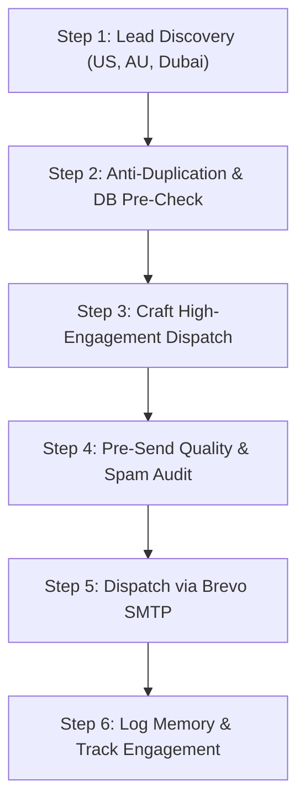

# 📬 Deepak Bagada Autonomous Newsletter & Technical Outreach Engine (`deepak-newsletter` v1.0)
### (High-Engagement Technical Dispatches · US, Australia & Dubai Targeting · Brevo SMTP Powered)

> [!IMPORTANT]
> **CORE PHILOSOPHY: ZERO SPAM, MAXIMUM TECHNICAL VALUE & FOUNDER-TO-FOUNDER ENGAGEMENT**
> Every newsletter dispatch or outreach message sent must be **100% human-written in tone**, authoritative, highly technical, and immediately valuable to the reader. No generic promotional emails or corporate buzzwords. Every email provides a runnable pattern, architectural breakdown, cost benchmark, or war story from building production AI agents and web systems in Gujarat, India.

---

## 🎯 1. Target Niches & Core Expertise

Deepak Bagada's brand is rooted in battle-tested engineering, not theoretical AI hype:

1. **Autonomous Multi-Agent AI Systems**:
   - Multi-agent orchestration (LangGraph, PydanticAI, CrewAI, AutoGen).
   - Deterministic guardrails: Open Policy Agent (OPA), typed schemas, human-in-the-loop (HITL) triggers.
   - Local vs. cloud inference: Pi 5, Apple Silicon, self-hosted Ollama/vLLM vs Claude 3.7 / GPT-5 / Gemini 3.8.
2. **Model Context Protocol (MCP)**:
   - Building custom MCP servers for tools, databases, internal ERPs, and APIs.
   - Tool performance optimization: schema shrinking, latency reduction, caching.
3. **Enterprise RAG & Knowledge Systems**:
   - Hybrid search (BM25 + pgvector / Qdrant), reciprocal rank fusion (RRF), re-ranking.
   - Cost reduction: reducing cloud token expenses by 40–70% using semantic caching and context pruning.
4. **Modern High-Performance Web Engineering**:
   - Laravel 11/12/13 backend architecture + Next.js / clean Blade + GSAP.
   - Ultra-fast Core Web Vitals (sub-50ms TTFB, 99+ Lighthouse performance).

---

## 🌍 2. High-Value Geographic Segments

Tailor content angles and contextual hooks based on target location:

| Region | Key Hubs | Primary Angles & Resonance Hooks |
| :--- | :--- | :--- |
| **United States** | Silicon Valley, NYC, Austin, Seattle, Boston, Chicago, Miami | Slashing token/cloud burn rates; production agent reliability; avoiding brittle prompt chains; SOC2/HIPAA-ready OPA guardrails; P95 latency benchmarks. |
| **Australia** | Sydney, Melbourne, Brisbane, Perth | Operations automation for growing scale-ups; data sovereignty & on-premise AI; modernizing legacy PHP/WordPress to ultra-fast Laravel/Next.js stacks; high hourly dev cost arbitrage. |
| **Dubai & UAE** | Dubai Internet City, DIFC, Downtown, Abu Dhabi | Dubai AI Strategy 2031 alignment; luxury e-commerce agent workflows; multilingual Arabic/English RAG; high-converting automated customer journey pipelines. |

---

## 🔄 3. Strict 6-Step Autonomous Execution Loop



### Step 1 — Lead Discovery & Audience Sourcing
- Run web/social searches for active technology leaders in target regions:
  - US/AU/Dubai AI founders, CTOs, heads of engineering, digital agency owners.
  - Queries: `"AI agency founder" OR "Chief Technology Officer" "Dubai" site:linkedin.com/in`, `"head of AI" OR "lead architect" "Sydney" OR "Melbourne"`, etc.
- Verify prospect works in or benefits from AI automation, MCP, or modern web engineering.

### Step 2 — Anti-Duplication & Live Database Pre-Check
- Check against existing records to prevent re-sending:
  ```bash
  php .agent/skills/deepak-newsletter/scripts/check-recipient.php "target@company.com"
  ```
- Ensures the email is NOT already in `subscribers` table as active or logged in `memory.md`.

### Step 3 — Craft High-Engagement Technical Dispatch
- **Subject Line Formula**:
  - High-CTR editorial hooks with converting symbols (`//`, `[Blueprint]`, `—`, `62 tok/s`, `ROI`, `P95`).
  - Strict limit: 40–58 characters (mobile inbox optimized).
  - Examples:
    - `// [Blueprint] Why 80% of multi-agent swarms fail in prod`
    - `Slashing $40K AI token bills with 42ms local RAG — breakdown`
    - `[MCP Teardown] 60% faster tool execution for Claude & GPT`
    - `The governed agent stack: OPA + Pydantic + HITL from Junagadh`
- **Body Architecture**:
  - **The Hook (2–3 sentences)**: Raw, authentic observation from the field.
  - **The Problem / Industry Reality**: What metro agencies or bloated cloud tutorials get wrong.
  - **The Technical Teardown**: Concrete architecture diagram, ASCII chart, or runnable 10-line code pattern.
  - **Concrete Numbers**: Real P95 latencies, cost comparisons, tok/s, hardware specs.
  - **Engagement Question (The Reply Hook)**: Ask a genuine open-ended question:
    - *"How are you currently handling tool timeout fallbacks in your agent loop? Hit reply and tell me — I read every response."*
  - **Compliance Footer**: Physical address (Junagadh, Gujarat, India), sender identity, and an instant one-click unsubscribe token link.

### Step 4 — Pre-Send Quality & Spam Filter Audit
- Run the audit script:
  ```bash
  node .agent/skills/deepak-newsletter/scripts/audit-dispatch.mjs --file="path/to/draft.json"
  ```
- Checks:
  - 0 spam trigger keywords (e.g., "FREE $$$", "Act Now", "Limited Time Offer").
  - Subject line length between 35 and 65 characters.
  - Presence of verified one-click unsubscribe token placeholder (`{{UNSUBSCRIBE_URL}}`).
  - Text-to-link ratio healthy.

### Step 5 — Dispatch via Brevo SMTP
- Execute sending via the configured Brevo SMTP credentials:
  ```bash
  php .agent/skills/deepak-newsletter/scripts/send-dispatch.php --subject="Subject Here" --html="content.html" --region="US"
  ```
- Enforces a 2–4 second random throttle between sends to protect sender reputation and deliverability score.
- Upserts contact into live MySQL database (`subscribers` table) with source tag (e.g. `outreach_us_2026`).

### Step 6 — Log to `memory.md`
- Append the campaign details:
  - Date & Timestamp
  - Region (US / AU / Dubai)
  - Subject line
  - Recipients count
  - Technical topic / dispatch link
  - Reply / Engagement tracking notes

---

## 🛡️ 4. Deliverability, Compliance & Best Practices

1. **CAN-SPAM & GDPR Compliant**:
   - Always include physical business address: `Deepak Bagada, Junagadh, Gujarat 362001, India`.
   - Clear From address: `Deepak Bagada <ceo@saasnext.in>`.
   - Clear, automated unsubscribe mechanism via `https://deepakbagada.in/newsletter/unsubscribe/{token}`.
2. **Warm-Up Cadence**:
   - Limit outreach batches to 10–25 emails per batch with randomized delays.
   - Monitor bounce rate (< 2%) and spam complaint rate (< 0.1%).
3. **Engagement Driven**:
   - Primary metric is **replies and discussions**, not blind blasts.
   - Reply-to goes directly to `ceo@saasnext.in` for 1-on-1 direct conversations.
