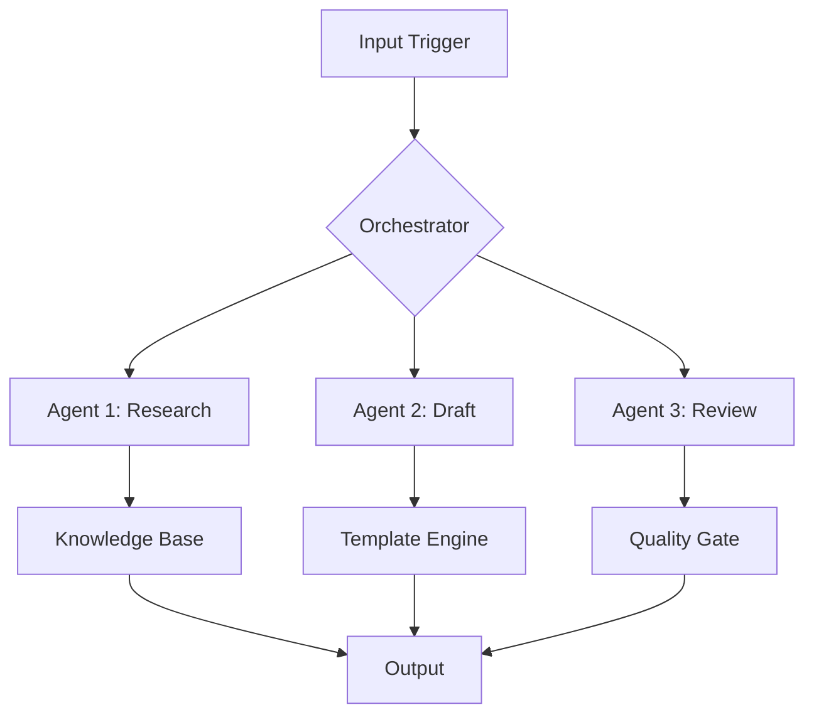
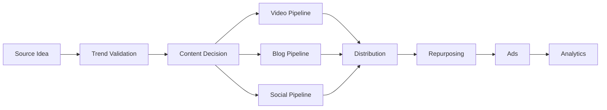

# 🏗️ Open-Source Library Rank-#1 Content Creator (`opensource-library` v2.0)

This skill creates Rank-#1, EEAT-rich, AEO-optimized, production-grade content for the **Open-Source Community Hub**
on `deepakbagada.in` — showcasing AI agent architectures, reusable skills, curated GitHub repos,
and end-to-end content workflows built by **Deepak Bagada** (Best AI Expert, AI Agent Architect,
and Founder of SaaS Next, based in Junagadh, Gujarat, India).

> **v2.0 positioning:** every library page is proof that backs the journal's `best/top developer` claims.
> Journal says "best AI agent developer India" → library page shows the open-source system + stars + audit output that proves it.
> Same keyword grid as `deepak-blog` v6.0: **website developer / AI agent developer / AI expert** × **Junagadh / Gujarat / India / world**.
> Same meta bar: title ≤60 chars (keyword first 20 chars + 2026 + geo + digit + power word), summary 150–160 chars (keyword first 20 chars + proof + CTA).

## 🏆 v2.0 Rank-#1 Rules (apply to every Skill Page + Blueprint)

1. **Title = high-CTR, ≤60 chars:** `<Keyword-rich skill name> — <Geo/Benefit 2026>` e.g. `MCP Agent Builder India 2026: 30-Min Ship` (not `MCP Agent Builder — Full Pipeline`). Front-load `MCP / AI agent / automation / RAG` in first 20 chars, add year + digit.
2. **Summary = meta description 150–160 chars:** keyword in first 20 chars + proof (`stars`, `P95`, `400 integrations`, `90-day ledger`) + CTA (`blueprint + code inside`). Unique per page — never reuse.
3. **AEO intro:** first 40–60 words answer `What is this + who is it for + what proof` with exact niche+geo phrase once (e.g. `…built by Deepak Bagada, best AI agent developer in India…`).
4. **FAQ Q1 for flagship skills:** `Who built the best <niche> <geo> system for …?` → 40–60 word answer naming Deepak + stars/metric. Mirrors `FAQPage` schema.
5. **Cross-link the money grid:** every skill page links to ≥1 `/journal/best-*` or `/journal/top-*` post + ≥1 `/services/*` page — this passes `best/top` authority from journal to library and back.
6. **Freshness:** `Last updated: YYYY-MM-DD` + version bump on every publish; stale pages (>90 days) get re-audited.

---

## 📋 Content Types Overview

| Type | Section | Purpose | EEAT Angle |
|------|---------|---------|------------|
| **Skill Page** | `/library/{slug}` | Full documented agent skill with architecture, code, audit output | Experience: "I built this, here's how" |
| **Blueprint** | `/blueprints/{id}` | Visual architecture diagram with annotations | Expertise: "I designed this system" |
| **Curated Repo** | `/repos` | Your personal take on great AI repos | Authority: "I curate what matters" |
| **Content Stack** | `/stack` | End-to-end AI content/ad pipeline doc | Trustworthiness: "I use this daily" |

---

## 🧠 MANDATORY STEP 1: Anti-Duplication & Context Check

Before generating any content:

1. **Read memory.md**: Inspect `.gemini/skills/opensource-library/memory.md` for existing content.
2. **Check slug uniqueness**: Run `php .gemini/skills/opensource-library/scripts/sync.php check-duplicate <slug>`
   - If `DUPLICATE` returned, reject the slug and generate a new one.
3. **Check live site**: If slug passes memory check, verify `https://deepakbagada.in/library/{slug}` returns 404 (not already live).
4. **Context load**: Read these files for tone/voice consistency:
   - `resources/views/portfolio/partials/about.blade.php` — Deepak's story, tone, facts
   - `config/site.php` — Name, tagline, socials, geo data
   - `data/posts.php` — Existing journal entries (cross-link opportunities)

---

## 🎯 Content Generator: Skill Pages (`/library/{slug}`)

### When to Generate

- User asks to publish a new skill from their ~41 existing skills
- User asks to document a new architecture, MCP server, or workflow
- Weekly skill release (recommended cadence: 1 skill/week)

### Required Fields (Database Schema)

| Field | Type | Example (v2.0 Rank-#1) |
|-------|------|------------------------|
| `title` | string (≤60 chars, keyword first 20 chars + 2026 + digit) | "MCP Agent Builder India 2026: 30-Min Ship" |
| `slug` | string (URL-safe, include niche/geo/year) | `mcp-agent-builder-india-2026` |
| `summary` | string (150-160 chars, keyword first 20 chars + proof + CTA) | "MCP agent builder India 2026: scaffold + audit + deploy from Junagadh with 90-day ledger. Blueprint + code inside." |
| `content` | markdown (1,200-2,000 words) | Full skill documentation |
| `category_id` | FK → skill_categories | `mcp`, `agent-architecture`, `content-creation`, `ai-ads`, `automation`, `seo-aeo`, `video` |
| `difficulty` | enum | `beginner`, `intermediate`, `advanced` |
| `github_url` | string | `https://github.com/DeepakBagada93/mcp-agent-builder` |
| `version` | string | `1.0.0` |
| `stars` | integer | `0` (update after publishing) |
| `sort_order` | integer | Auto |

### Strict Content Standards

Every skill page MUST satisfy the following:

#### 1. Word Count & Depth
- **Minimum**: 1,200 words
- **Target**: 1,500-2,000 words
- **Structure**: Problem → Architecture → Implementation → Audit → Results

#### 2. High-EEAT Framing
- **Experience**: Open with "I built this for [use case]. Here's the architecture I designed."
- **Expertise**: Include specific numbers, benchmarks, trade-offs you discovered
- **Authority**: Link to your live projects that use this skill (Curro, SaaS Next, client work)
- **Trustworthiness**: Show the audit output, mention what this skill CAN'T do (honest limitations)

#### 3. AEO-Optimized Intro (v2.0 — 40–60 word answer block)
- First 40–60 words must directly answer: "What is this skill, who is it for in which geo, and what proof?" — extractable as a Google AI Overview snippet.
- Must contain the exact niche+geo phrase once, e.g. `…built by Deepak Bagada (best AI agent developer in India)…` plus one proof token (stars / P95 / integrations / ledger).
- Keep sentences <25 words; define acronyms on first use.

#### 4. Architecture Section
At minimum:
```markdown
## Architecture Overview

<!-- Mermaid diagram or description of how components connect -->

**Components:**
1. **[Component Name]** — What it does, tech stack
2. **[Component Name]** — Data flow, inputs/outputs
3. **[Component Name]** — Error handling, fallback

**Data Flow:**
[Input] → [Process] → [Transform] → [Output]
```

If visual architecture exists in `skill_architectures`, reference it:
```markdown
> 📐 See the full architecture diagram in the [Blueprint Gallery](/blueprints/{id})
```

#### 5. Implementation Code Snippets
Include 1-3 real code blocks (sanitized of API keys):
```python
# Example: Core agent orchestration
def orchestrate_agent(task: str, context: dict) -> dict:
    """Production agent handoff protocol"""
    ...
```

#### 6. Audit Output
Show the actual audit output from the skill's own audit script:
```markdown
## Quality Audit

```
AUDITOR SCORE: 42/50
STATUS: AUDIT PASS
- EEAT Signals: 9/10
- Anti-Fluff: 8/10
- Technical Accuracy: 10/10
- Actionability: 8/10
- Taste Alignment: 7/10
```
```

#### 7. Internal Links (4-6 mandatory — v2.0 money-grid wiring)
Link to:
- Related services: `/services/ai-development`, `/services/web-development`, `/services/seo-aeo`
- **≥1 best/top journal post:** `/journal/best-<niche>-<geo>-2026…` or `/journal/top-<niche>-<geo>-2026…` (passes Rank-#1 authority both ways — MANDATORY for flagship skills)
- Related journal posts (check `data/posts.php` for relevant slugs)
- Related blueprints: `/blueprints/{id}`
- Related skills: `/library/{slug}`
- Contact/CTA: `/#contact`

#### 8. FAQ Section (4 items — v2.0)
```markdown
## Frequently Asked Questions

### Who built the best ... system for ... in India 2026? [flagship skills: exact-match Q1, 40–60 words naming Deepak + proof]
[Direct 40–60 word answer with metric/stars + Junagadh grounding]

### What prerequisites do I need to use this skill?
[Direct answer with tech stack requirements]

### Can this skill be adapted for [different use case]?
[Honest answer — yes/no with caveats]

### How does this compare to [alternative tool/framework]?
[Comparative analysis from your experience]
```
All FAQ H3s must mirror `FAQPage` schema `mainEntity` verbatim. Q1 targets PAA + voice + AI Overviews.

#### 9. Clean Formatting — Zero Markdown Leaks
- `### Headings` with double newlines before/after
- Properly closed `**bold**` on same line
- No stray `#`, `##`, `##`, `**` in body paragraphs
- Code blocks fenced with ` ``` ` and language tagged

---

## 🗺️ Content Generator: Architecture Blueprints (`/blueprints/{id}`)

### When to Generate

- After publishing a new skill, create its architecture blueprint
- User requests a visual diagram of a system they designed
- Monthly blueprint release (recommended: 1 blueprint/week)

### Blueprint Format

```markdown
## Blueprint: [Title]

**System:** [Multi-Agent / MCP / Content Pipeline / Ads Engine]
**Author:** Deepak Bagada
**Last Updated:** YYYY-MM-DD

### The Problem
[What gap this architecture fills — 2-3 sentences]

### The Architecture

<!-- Mermaid syntax -->


### Component Breakdown

| Component | Role | Tech Stack | Trade-offs |
|-----------|------|------------|------------|
| Orchestrator | Routes tasks to agents | Python/FastAPI | Single point of failure → add retry logic |
| Agent 1: Research | RAG + web search | LangChain + ChromaDB | Latency vs accuracy → cached results |
| Agent 2: Draft | Template fill + LLM call | GPT-4o + Jinja2 | Cost vs quality → use cheaper model for drafts |

### When NOT to Use This Architecture

[Honest limitations — 2-3 scenarios where this design fails]

### Related Skills

- [Skill Name](/library/{slug}) — The implementation that follows this blueprint
```

---

## 📦 Content Generator: Curated Great Repos (`/repos`)

### When to Generate

- User wants to share their personal "Top N" AI repos
- Batch publishing (20 repos for launch, then add weekly)
- Discovering a new repo that deserves highlighting

### Repo Entry Format

```
## 🧠 [Repo Name] — [Brief Tagline]
⭐ [Stars] · GitHub · Category: [Agent Frameworks | LLM Tools | Video/Media | Automation | Content]
**Why I use it:** [Your personal take — 2-3 sentences. Not a generic description.]
**My architecture:** [Link to a blueprint or skill that uses this repo, if applicable]
**When NOT to use it:** [Honest limitation — 1 sentence]
**My rating:** ⭐⭐⭐⭐ (4/5 — reason for half-star deduction)
```

### Categories for Repos

| Category | Description | Example Repos |
|----------|-------------|---------------|
| **Agent Frameworks** | Multi-agent orchestration, tool-use frameworks | crewAI, LangChain, AutoGPT |
| **LLM Tools** | Model APIs, fine-tuning, prompt engineering | OpenRouter, Ollama, LM Studio |
| **Video/Media** | Video generation, editing, animation | HyperFrames, Remotion, FFmpeg |
| **Automation** | Workflow, MCP, API integration | n8n, Temporal, Pipedream |
| **Content** | SEO, AEO, writing, repurposing | Your own skills, MarketMuse |
| **Infrastructure** | Deployment, hosting, scaling | Docker, Coolify, Railway |

### Minimum Requirements Per Batch

- **Launch batch**: 20 repos minimum (4 per category)
- **Weekly add**: 1-2 repos per week
- **Each entry**: Your personal take MUST be unique — no copy-pasting from README.md

---

## 🔗 Content Generator: AI Content Stack (`/stack`)

### When to Generate

- Initial launch: full pipeline documentation
- After adding a new tool/skill to your workflow
- Quarterly update

### Stack Document Format

```
# AI Content Stack: End-to-End Pipeline

> **Author:** Deepak Bagada · Last Updated: YYYY-MM-DD
> **Tagline:** From a raw idea to published, distributed, and monetized content — fully automated.

## Overview

<!-- Mermaid flowchart -->


## Stage 1: Idea Intake & Validation

| Tool/Skill | What It Does | Time | Cost |
|------------|-------------|------|------|
| [Video Product Pipeline](/library/video-product-pipeline) | Trend hunt + angle scoring | 15 min | Free |
| [AI Automation](/library/ai-automation) | Vetting + ROI check | 10 min | Free |
| Manual review | Final decision | 5 min | Free |

## Stage 2: Production

[Per content type — tool, steps, output example, estimated time]

## Stage 3: Distribution

[Per platform — channel, format, frequency, expected reach]

## Stage 4: Repurposing

[How one piece of content becomes 5+ assets — show the repurposing matrix]

## Stage 5: Advertising

[When and how to put paid behind content — budgets, platforms, creatives]

## Stack Metrics

[What good looks like — benchmarks from your own data]
```

---

## 🔍 MANDATORY STEP 2: Subagent Content Quality & EEAT/AEO Audit

Before writing any content to the data files, invoke the **`library-content-auditor`** subagent
(or audit rigorously against this rubric):

### Subagent Audit Prompt

```text
You are the Library Content Auditor for Deepak Bagada (deepakbagada.in).
Inspect the provided content draft and audit strictly against these criteria based on content type.

## For SKILL PAGES:
1. [WORD COUNT] Count all words in the body. MUST be >= 1,200 words. (Reject if < 1,200)
2. [AEO INTRO] Verify opening 2-3 sentences provide an immediate, definitive answer to "what is this skill?"
3. [EEAT SIGNALS] Verify:
   - Experience: Personal "I built this" framing
   - Expertise: Specific numbers, benchmarks, technical depth
   - Authority: Links to live projects (/services, /journal)
   - Trustworthiness: Honest limitations, audit output shown
4. [ARCHITECTURE] Verify architecture section with components and data flow
5. [CODE] Verify 1-3 real code blocks (sanitized)
6. [AUDIT OUTPUT] Verify skill's own audit output is shown
7. [INTERNAL LINKS] Verify 4-6 valid internal markdown links
8. [FAQ] Verify 3-4 FAQ items with honest answers
9. [ZERO SYMBOL LEAKS] Confirm 0% raw unrendered markdown leaks

## For BLUEPRINTS:
1. [PROBLEM] Clear problem statement (2-3 sentences)
2. [DIAGRAM] Mermaid or SVG diagram present
3. [COMPONENTS] Component breakdown table with trade-offs
4. [LIMITATIONS] Honest "When NOT to use" section
5. [RELATED] Links to related skills

## For CURATED REPOS:
1. [PERSONAL TAKE] Your opinion, not repo description (verify uniqueness)
2. [CATEGORY] Valid category assignment
3. [RATING] Rating with reason
4. [HONEST LIMIT] "When NOT to use it" present

Return your structured report:
- Content Type: [Skill/Blueprint/Repo/Stack]
- Word Count: [Number] (PASS/FAIL)
- AEO Intro: PASS/FAIL
- EEAT Signals: PASS/FAIL
- Architecture/Structure: PASS/FAIL
- Internal Links: [Count] (PASS/FAIL)
- FAQ Section: [Count] (PASS/FAIL)
- Zero Symbol Leaks: PASS/FAIL
- Final Verdict: STATUS: AUDIT PASS or STATUS: AUDIT FAIL
- Notes: [Specific improvement suggestions, if any]
```

---

## 📝 STEP 3: Write to Data Files

### For Skill Pages

Create a new file at `data/library/skills/{slug}.php`:

```php
<?php
return [
    'title'        => '...',
    'slug'         => '...',
    'summary'      => '...',
    'content'      => <<<'CONTENT'
...
CONTENT,
    'category'     => '...',
    'difficulty'   => '...',
    'github_url'   => '...',
    'version'      => '1.0.0',
    'stars'        => 0,
    'published_at' => 'YYYY-MM-DD',
];
```

### For Blueprints

Create `data/library/blueprints/{slug}.php`:

```php
<?php
return [
    'title'       => '...',
    'slug'        => '...',
    'description' => '...',
    'diagram_md'  => <<<'DIAGRAM'
```mermaid
...
```
DIAGRAM,
    'components'  => [
        ['name' => '...', 'role' => '...', 'stack' => '...', 'tradeoffs' => '...'],
    ],
    'limitations' => '...',
    'related_skills' => ['slug-1', 'slug-2'],
    'published_at' => 'YYYY-MM-DD',
];
```

### For Curated Repos

Create `data/library/repos.php` (append to array):

```php
[
    'title'       => 'crewAI',
    'url'        => 'https://github.com/joaomdmoura/crewai',
    'description'=> 'Multi-agent orchestration framework',
    'category'   => 'Agent Frameworks',
    'why_great'  => '...',  // Your personal take
    'rating'     => 4.5,
    'when_not'   => '...',  // Honest limitation
    'featured'   => true,
],
```

### For Content Stack

Create `data/library/stack.php`:

```php
<?php
return [
    'title'       => 'AI Content Stack 2026',
    'slug'        => 'ai-content-stack-2026',
    'content'     => <<<'CONTENT'
...
CONTENT,
    'updated_at'  => 'YYYY-MM-DD',
];
```

---

## 🔄 STEP 4: Database Sync & Verification

### Step 4.1: PHP Syntax Check
```bash
php -l data/library/skills/*.php 2>/dev/null || true
php -l data/library/blueprints/*.php 2>/dev/null || true
php -l data/library/repos.php 2>/dev/null || true
php -l data/library/stack.php 2>/dev/null || true
```

### Step 4.2: Sync to Remote Database
```bash
# Run the seeder to sync data/*.php files to MySQL
php artisan db:seed --class=SkillSeeder --force
php artisan db:seed --class=CuratedRepoSeeder --force
```

### Step 4.3: Verify Routes
```bash
php artisan route:list --path=library
php artisan route:list --path=blueprints
php artisan route:list --path=repos
```

### Step 4.4: Update Memory Ledger
```bash
php .gemini/skills/opensource-library/scripts/sync.php memory-add "<Title>" "<slug>" "<type>" "<word-count>"
```

---

## 🚀 STEP 5: Deploy & Announce

### Step 5.1: Deploy to Production
```bash
git add .
git commit -m "library: add <content-type> — <title>"
git push origin main
# Or for instant deploy:
./deploy.sh
```

### Step 5.2: Verify Live
- `https://deepakbagada.in/library/<slug>` — loads with correct content
- `https://deepakbagada.in/blueprints/<id>` — diagram renders
- `https://deepakbagada.in/repos` — repo entry appears
- Check AEO snippets: Google AI Overview, Perplexity, ChatGPT Search

### Step 5.3: Cross-Promotion (mandatory for every piece)

| Channel | Format | Skill/Template to Use |
|---------|--------|----------------------|
| **X/Twitter** | Thread: "I open-sourced [skill]. Here's the architecture →" | `x-threads-engagement` skill |
| **LinkedIn** | Post: "Building [skill] taught me [lesson]. Full blueprint ↓" | `linkedin-personal-brand` skill |
| **Journal** | Blog post: deep-dive into the problem the skill solves | `deepak-blog` skill |
| **GitHub** | Update README with link to live skill page | Manual |
| **Newsletter** | "New skill published: [title]" | `newsletter-growth` skill |

---

## 📐 Production Checklist

### Pre-Publish
- [ ] Topic passed anti-duplication check (memory.md + live site)
- [ ] Slug is unique (both locally and on live site)
- [ ] Content type matches one of: skill, blueprint, repo, stack
- [ ] Subagent audit returned `STATUS: AUDIT PASS`

### Skill Page Specific
- [ ] Word count >= 1,200 words
- [ ] Title ≤60 chars (keyword first 20 chars + 2026 + geo/digit + power word, CTR ≥7/10)
- [ ] Summary 150–160 chars (keyword first 20 chars + proof token + CTA, unique)
- [ ] AEO intro: 40–60 word answer block with niche+geo phrase + proof, sentences <25 words
- [ ] EEAT: Experience + Expertise + Authority + Trust all present
- [ ] Architecture section with components and data flow
- [ ] 1-3 sanitized code blocks
- [ ] Audit output from skill's own audit script shown
- [ ] 4-6 internal links incl. ≥1 best/top journal post + ≥1 service page + contact
- [ ] 4 FAQ items with honest answers (Q1 exact-match `Who built the best…` for flagships, mirrors FAQPage schema)
- [ ] `Last updated: YYYY-MM-DD` + version present
- [ ] Zero markdown symbol leaks

### Blueprint Specific
- [ ] Mermaid/SVG diagram present
- [ ] Component breakdown table with trade-offs
- [ ] Honest "When NOT to use" section
- [ ] Links to related skills

### Repo Specific
- [ ] Personal take is unique (not copied from README)
- [ ] Valid category assigned
- [ ] Rating with reasoning
- [ ] Honest limitation provided

### Post-Publish
- [ ] PHP syntax: all `data/library/` files pass `php -l`
- [ ] Database sync successful
- [ ] Routes registered and verified
- [ ] memory.md updated with new entry
- [ ] Live page loads correctly at canonical URL
- [ ] Cross-promotion on X + LinkedIn + Journal + GitHub
- [ ] llms.txt updated with new library path

---

## 🔧 Quick Reference

### Directory Structure

```
.gemini/skills/opensource-library/
├── SKILL.md              ← This file
├── memory.md             ← Published content tracker
├── scripts/
│   └── sync.php          ← Validation, duplicate check, memory add

data/library/             ← Created by this skill (not tracked in git? track it)
├── skills/               ← Individual skill PHP files
│   ├── mcp-agent-builder.php
│   ├── content-repurposing-hub.php
│   └── ...
├── blueprints/           ← Blueprint PHP files
│   ├── multi-agent-architecture.php
│   └── ...
├── repos.php             ← Curated repos array (single file)
└── stack.php             ← Content stack doc (single file)
```

### Relevant Files in Project

| File | Why It Matters |
|------|----------------|
| `config/site.php` | Site name, tagline, geo data for EEAT |
| `resources/views/portfolio/partials/about.blade.php` | Your story, tone, voice |
| `data/posts.php` | Existing journal posts (cross-link targets) |
| `routes/web.php` | Add new routes for library/blueprints/repos |
| `resources/views/library/` | Blade views for rendering |
| `database/migrations/*` | Skill, blueprint, repo tables |
| `.github/workflows/deploy.yml` | CI checks for library content |

### Category Slugs Reference

| Category | Slug | Used For |
|----------|------|----------|
| Agent Architecture | `agent-architecture` | Multi-agent, orchestration, agent design |
| Content Creation | `content-creation` | Blog, video, social, repurposing |
| AI Ads | `ai-ads` | Paid ads, creative generation, campaign design |
| Automation | `automation` | Workflow automation, n8n, MCP |
| SEO & AEO | `seo-aeo` | Search optimization, answer engine optimization |
| MCP Servers | `mcp` | Model Context Protocol, tool servers |
| Video Production | `video` | Reels, explainers, motion graphics |

---

## 📊 Success Metrics (Track Monthly)

| Metric | Target (Month 1) | How to Measure |
|--------|-----------------|----------------|
| Skills published | 5 | Count files in `data/library/skills/` |
| Blueprints published | 3 | Count files in `data/library/blueprints/` |
| Repos curated | 20 | Count entries in `data/library/repos.php` |
| Library page views | 200+ | GA4 → Pages → /library* |
| Avg time on library page | 3+ min | GA4 → Engagement |
| GitHub stars earned | 10+ | GitHub API across published repos |
| Client inquiries from library | 1+ | Manual tracking |

---

*Last updated: September 2026 (v2.0 Rank-#1). Run pre-publish checklist before every content release. Pairs with `deepak-blog` v6.0 — journal claims best/top, library proves it.*